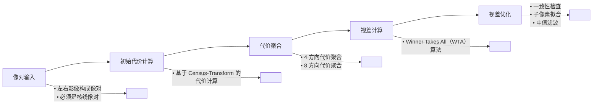
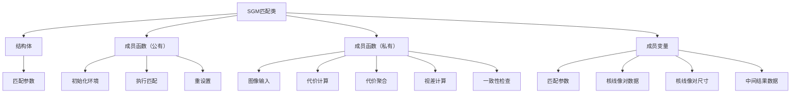

# SGM_Learn

复现项目：[SemiGlobalMatching](https://github.com/ethan-li-coding/SemiGlobalMatching)

------


### 框架设计

算法框架



代码框架



------

### 环境

windows10 / visual studio 2022 

------


### 实现思路

#### 1. 代价计算：基于Census变换

匹配代价计算是双目立体匹配的第一步，在双目匹配算法中，大部分算法会为每个像素预先设置一个固定的视差搜索范围 $D(d_{min} ~ d_{max})$，将像素的视差真值限定在范围 $D$ 内，并引入一个大小为 $W × H × D$ 的三维代价空间 $C$，$C$ 中的每个元素映射左影像每个像素在视差范围内每个视差下的匹配代价值，而匹配代价计算即是通过计算像素之间的相关性来填充 $C$ 的步骤。

Census变换是根据窗口内邻域像素和中心像素的大小比较生成一个 0/1 位串（e.g. 1011011000），即通过将邻域窗口（窗口大小为 $n × m$ ，$n$ 和 $m$ 都为奇数）内的像素灰度值与窗口中心像素的灰度值进行比较，将比较得到的布尔值映射到一个比特串中，最后用比特串的值作为中心像素的 Census 变换值 $C_s$。具体实现为：

$$
C_S(u, v) := \bigotimes_{i=-n'}^{n'} \bigotimes_{j=-m'}^{m'} \xi \left( I(u, v), I(u+i, v+j) \right)
$$

其中 $n'$ 和 $m'$ 分别为不大于 $n$ 和 $m$ 的一半的最大整数，$⊕$ 为比特位的逐位连接运算。

$ξ$​运算则由公式 2 定义：

$$
\xi(x, y) = 
\begin{cases} 
0 & \text{if } x \leq y \\
1 & \text{if } x > y 
\end{cases}
$$

即逐像素选择特定尺寸的窗口逐一和中心像素比较大小，比较结果组成位串（大于就是 1，小于就是 0）。

代价计算是计算两个 census 值的汉明（hamming）距离，也就是两个位串中不同的位的个数。即对左影像每个像素，在视差范围内给定一个视差值，可以定位到右影像中的一个像素，最后计算这两个像素的 census 值的汉明距离。

------

#### 2. 代价聚合

由于代价计算步骤只考虑了局部的相关性，对噪声非常敏感，无法直接用来计算最优视差，所以 SGM 算法通过代价聚合步骤，使聚合后的代价值能够更准确地反应像素之间的相关性。

SGM 提出一种路径代价聚合的思路，即将像素所有视差下的匹配代价进行像素周围所有路径上的一维聚合得到路径下的路径代价值，然后将所有路径代价值相加得到该像素聚合后的匹配代价值。像素 $p$ 沿着某条路径 $r$​ 的路径代价计算方法如下：

$$
L_r(p, d) = C(p, d) + \min \left\{
\begin{array}{l}
L_r(p - r, d) \\
L_r(p - r, d - 1) + P_1 \\
L_r(p - r, d + 1) + P_1 \\
\min_i L_r(p - r, i) + P_2
\end{array}
\right\} - \min_i L_r(p - r, i)
$$

其中：

> $L(p−r,d)$ 表示路径内上一个像素视差为 d 时的聚合代价值  
> $L(p - r,d - 1)$ 表示路径内上一个像素视差为 d-1 时的聚合代价值  
> $L(p - r,d + 1)$ 表示路径内上一个像素视差为 d+1 时的聚合代价值  
> $min(L(p - r, i))$ 表示路径内上一个像素所有代价值的最小值  
> $P_1$ 为惩罚项 $P1$，输入参数  
> $P_2$ 为惩罚项 $P2$，计算方式是 $P2_{init}/(I_p - I_{p-r})$，$I$ 表示灰度，$P2_{init}$ 为 $P2$​ 的最大值，输入参数

- $P_2′$ 为 $P_2$ 的初始值，一般设置为远大于 $P_1$ 的数。这个公式的含义是：如果像素和它的邻域像素亮度差很大，那么该像素很可能是位于视差非连续区域，则一定程度上允许其和邻域像素的视差差值超过 1 个像素，对于超过 1 个像素的惩罚力度就适当减小一点。

代码思路：

1. 做一个初始化，让第一个像素的聚合代价值等于它的初始代价值，从路径上第二个像素开始聚合。
2. 定义一个临时的数组来存放路径上上个像素的聚合代价值，好处是在聚合当前像素时，在局部小内存块里读取上一个像素的代价值速度更快。
3. 定义一个临时的最小代价值，来记录路径上上一个像素的聚合代价值。
4. 遍历路径上所有像素，按照公式计算。

   具体实现可参考下图：

   

------

#### 3. 视差计算与视差优化

视差计算是采用 WTA（Winner Takes All）赢家通吃算法，即在视差范围内选择一个代价值最小的视差作为像素的最终视差。只需遍历一遍代价数组。

视差优化是对通过视差计算得到的视差图进行进一步的优化处理，剔除错误视差，提高视差精度，使视差值更可靠、更精确。

##### 子像素拟合

用于提高视差精度，因为视差计算得到的视差图是整像素精度，在很多应用中都无法满足精度要求，SGM 采用 **二次曲线内插** 的方法获得子像素精度，对最优视差的代价值以及前后两个视差的代价值进行二次曲线拟合，曲线的极值点所对应的视差值即为新的子像素视差值。可参考下图：


##### 一致性检查

将左右影像位置对调，再计算一个右影像视差图，对照两个视差图来看同名点对是否能够相互匹配成功，即：

$$
D_p =
\begin{cases} 
D_{bp} & \text{if } |D_{bp} - D_{mq}| \leq 1, \, q = e_{bm}(p, D_{bp}) \\
D_{inv} & \text{otherwise.}
\end{cases}
$$

右影响视差图具体实现为：通过左影像的代价数组，来推算右影像的代价数组，从而计算右影像的视差图。即：右影像 $(i,j)$ 视差为 $d$ 的代价 = 左影像 $(i,j+d)$ 视差为 $d$ 的代价。

具体就是右影像的像素 $(i,j)$，根据视差值 $d$ 可算出左影像的对应像素位置为 $(i,j+d)$，然后把左影像 $(i,j+d)$ 同样视差值 $d$ 下的代价值取出来赋给 $Cost(i,j,d)$​。

##### 唯一性约束

最优视差的代价值应该是所有候选视差中唯一的最小代价，计算最小代价和次最小代价的相对差值，如果差值小于阈值，那就表明最小的两个代价值相差不明显，就给这个像素赋一个无效视差。

##### 剔除小连通区

剔除连通在一起的小块错误匹配像素，这些像素是一致性检查的漏网之鱼，看上去和周围的像素极不协调，而且连通成一定大小的块。

通过区域跟踪，把它们跟踪成块，然后判断块的大小是否小于一定的阈值，如果是则剔除，即把整块都置为无效视差。

##### 中值滤波

剔除视差图中的一些孤立的离群外点，同时起到填补小洞的作用。

#### 4. 视差填充

##### 无效区不同处理

**遮挡区**：由于前景遮挡而在左视图上可见但在右视图上不可见的像素区域。

**误匹配区**：位于非遮挡区域的错误匹配像素区域

判断遮挡区：

1. 像素 $p$ 是通过各种优化操作而判定的无效像素。
2. 左影像像素 $p$ 在右影像上的匹配像素为 $q=p-d$，像素 $q$ 在右视差图上的值为 $d_r$，通过 $d_r$ 找到左影像的匹配点 $p'$，获取 $p'$ 的视差 $d'$，若 $d' > d$，则 $p$ 为遮挡区。

这个判定所基于的两个假设是：

1. $p$ 的视差值和周围的背景像素视差值比较接近。
2. $p$ 因为遮挡而在右影像上不可见，所以它会匹配到右影像上的前景像素，而前景像素的视差值必定比背景像素大，即比 $p$ 的视差大。

在一致性检查让 $p$ 的视差值无效之前，判断 $p$ 是否是遮挡区和误匹配区。

把无效像素分为了遮挡区和误匹配区，填充的有效视差来源也要区别分析。

##### 有效视差如何得到

有效视差都来自于周围有效像素的视差值，区别在于如何从周围的有效视差中选出最合适的一个。

对于遮挡区像素，因为它的身份是背景像素，所以它是不能选择周围的前景像素视差值，应该选择周围背景像素的视差值。由于背景像素视差值比前景像素小，所以在收集周围的有效视差值后，应选择较小的几个，具体选择的是次最小视差。

对于误匹配像素，它并不位于遮挡区，所以周围的像素都是可见的，而且没有遮挡导致的视差非连续的情况，它就像一个连续的表面凸起的一小块噪声，这时周围的视差值都是等价的，没有哪个应选哪个不应选，这时取中值就很适合。

$$
D'_p = 
\begin{cases} 
\text{seclow}_i v_{pi} & \text{if } \mathbf{p} \text{ is occluded,} \\
\text{med}_i v_{pi} & \text{if } \mathbf{p} \text{ is mismatched,} \\
D_p & \text{otherwise.}
\end{cases}
$$

以像素为中心，等角度往外发射 8 条射线，收集每条射线碰到的第一个有效像素就为有效像素。


------

### 代码框架设计

#### class SemiGlobalMatching

```c++
参数结构体
class SemiGlobalMatching
{
public:
SemiGlobalMatching();
~SemiGlobalMatching();

/** \brief SGM参数结构体 */
struct SGMOption {
	uint8	num_paths;		// 聚合路径数
	sint32  min_disparity;	// 最小视差
	sint32	max_disparity;	// 最大视差

	// P1,P2 
	// P2 = P2_int / (Ip-Iq)
	sint32  p1;				// 惩罚项参数P1
	sint32  p2_int;			// 惩罚项参数P2

	SGMOption(): num_paths(8), min_disparity(0), max_disparity(64), p1(10), p2_int(150) {
	}

};
public:
/**
 * \brief 类的初始化，完成一些内存的预分配、参数的预设置等
 * \param width		输入，核线像对影像宽
 * \param height	输入，核线像对影像高
 * \param option	输入，SemiGlobalMatching参数
 */
bool Initialize(const uint32& width, const uint32& height, const SGMOption& option);

/**
 * \brief 执行匹配
 * \param img_left		输入，左影像数据指针 
 * \param img_right		输入，右影像数据指针
 * \param disp_left		输出，左影像深度图指针，预先分配和影像等尺寸的内存空间
 */
bool Match(const uint8* img_left, const uint8* img_right, float32* disp_left);

/**
 * \brief 重设
 * \param width		输入，核线像对影像宽
 * \param height	输入，核线像对影像高
 * \param option	输入，SemiGlobalMatching参数
 */
bool Reset(const uint32& width, const uint32& height, const SGMOption& option);

private:

/** \brief Census变换 */
void CensusTransform() const;

/** \brief 代价计算	 */
void ComputeCost() const;

/** \brief 代价聚合	 */
void CostAggregation() const;

/** \brief 视差计算	 */
void ComputeDisparity() const;

/** \brief 一致性检查 */
void LRCheck() const;

private:
/** \brief SGM参数	 */
SGMOption option_;

/** \brief 影像宽	 */
sint32 width_;

/** \brief 影像高	 */
sint32 height_;

/** \brief 左影像数据	 */
uint8* img_left_;

/** \brief 右影像数据	 */
uint8* img_right_;

/** \brief 左影像census值	*/
uint32* census_left_;

/** \brief 右影像census值	*/
uint32* census_right_;

/** \brief 初始匹配代价	*/
uint8* cost_init_;

/** \brief 聚合匹配代价	*/
uint16* cost_aggr_;

/** \brief 左影像视差图	*/
float32* disp_left_;

/** \brief 是否初始化标志	*/
bool is_initialized_;
};
```

#### sgm_util定义空间

封装实现`class SemiGlobalMatching` 中方法的子类函数

```c++
/**
 * \brief census变换
 * \param source	输入，影像数据
 * \param census	输出，census值数组
 * \param width		输入，影像宽
 * \param height	输入，影像高
 */
void CheckCensusTransform(const uint32* census, const sint32& width, const sint32& height);
void census_transform_5x5(const uint8* source, uint32* census, const sint32& width, const sint32& 

// Hamming距离
uint8 Hamming32(const uint32& x, const uint32& y);

/**
 * \brief 左右路径聚合 → ←
 * \param img_data			输入，影像数据
 * \param width				输入，影像宽
 * \param height			输入，影像高
 * \param min_disparity		输入，最小视差
 * \param max_disparity		输入，最大视差
 * \param p1				输入，惩罚项P1
 * \param p2_init			输入，惩罚项P2_Init
 * \param cost_init			输入，初始代价数据
 * \param cost_aggr			输出，路径聚合代价数据
 * \param is_forward		输入，是否为正方向（正方向为从左到右，反方向为从右到左）
 */
void CostAggregateLeftRight(const uint8* img_data, const sint32& width, const sint32& height, const sint32& min_disparity, const sint32& max_disparity,
	const sint32& p1, const sint32& p2_init, const uint8* cost_init, uint8* cost_aggr, bool is_forward = true);

/**
 * \brief 上下路径聚合 ↓ ↑
 * \param img_data			输入，影像数据
 * \param width				输入，影像宽
 * \param height			输入，影像高
 * \param min_disparity		输入，最小视差
 * \param max_disparity		输入，最大视差
 * \param p1				输入，惩罚项P1
 * \param p2_init			输入，惩罚项P2_Init
 * \param cost_init			输入，初始代价数据
 * \param cost_aggr			输出，路径聚合代价数据
 * \param is_forward		输入，是否为正方向（正方向为从上到下，反方向为从下到上）
 */
void CostAggregateUpDown(const uint8* img_data, const sint32& width, const sint32& height, const sint32& min_disparity, const sint32& max_disparity,
	const sint32& p1, const sint32& p2_init, const uint8* cost_init, uint8* cost_aggr, bool is_forward = true);

/**
 * \brief 对角线1路径聚合（左上<->右下）↘ ↖
 * \param img_data			输入，影像数据
 * \param width				输入，影像宽
 * \param height			输入，影像高
 * \param min_disparity		输入，最小视差
 * \param max_disparity		输入，最大视差
 * \param p1				输入，惩罚项P1
 * \param p2_init			输入，惩罚项P2_Init
 * \param cost_init			输入，初始代价数据
 * \param cost_aggr			输出，路径聚合代价数据
 * \param is_forward		输入，是否为正方向（正方向为从左上到右下，反方向为从右下到左上）
 */
void CostAggregateDagonal_1(const uint8* img_data, const sint32& width, const sint32& height, const sint32& min_disparity, const sint32& max_disparity,
	const sint32& p1, const sint32& p2_init, const uint8* cost_init, uint8* cost_aggr, bool is_forward = true);

/**
 * \brief 对角线2路径聚合（右上<->左下）↙ ↗
 * \param img_data			输入，影像数据
 * \param width				输入，影像宽
 * \param height			输入，影像高
 * \param min_disparity		输入，最小视差
 * \param max_disparity		输入，最大视差
 * \param p1				输入，惩罚项P1
 * \param p2_init			输入，惩罚项P2_Init
 * \param cost_init			输入，初始代价数据
 * \param cost_aggr			输出，路径聚合代价数据
 * \param is_forward		输入，是否为正方向（正方向为从上到下，反方向为从下到上）
 */
void CostAggregateDagonal_2(const uint8* img_data, const sint32& width, const sint32& height, const sint32& min_disparity, const sint32& max_disparity,
	const sint32& p1, const sint32& p2_init, const uint8* cost_init, uint8* cost_aggr, bool is_forward = true);


/**
 * \brief 中值滤波
 * \param in				输入，源数据
 * \param out				输出，目标数据
 * \param width				输入，宽度
 * \param height			输入，高度
 * \param wnd_size			输入，窗口宽度
 */
void MedianFilter(const float32* in, float32* out, const sint32& width, const sint32& height, const sint32 wnd_size);


/**
 * \brief 剔除小连通区
 * \param disparity_map		输入，视差图
 * \param width				输入，宽度
 * \param height			输入，高度
 * \param diff_insame		输入，同一连通区内的局部像素差异
 * \param min_speckle_aera	输入，最小连通区面积
 * \param invalid_val		输入，无效值
 */
void RemoveSpeckles(float32* disparity_map, const sint32& width, const sint32& height, const sint32& diff_insame, const uint32& min_speckle_aera, const float32& invalid_val);
```

------

